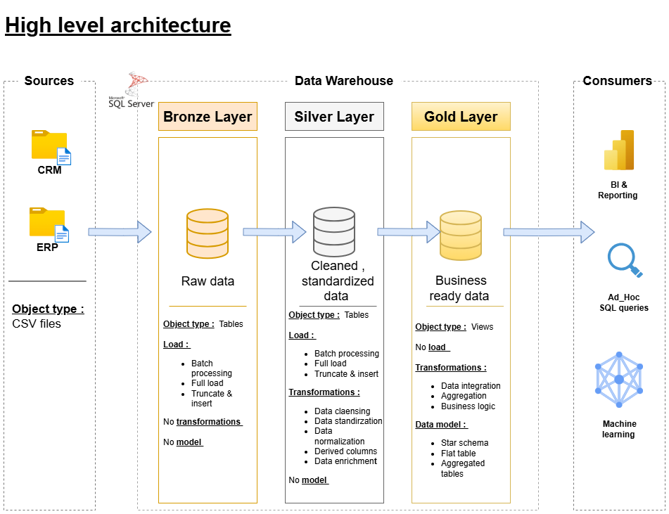

# Data warehouse and analytics projects

This project showcases an end-to-end data warehousing and analytics solution, covering everything from designing and building the data warehouse to delivering meaningful, data-driven insights.
It was completed thanks to the guidance and learning resources provided by "Data With Baraa" , while applying industry best practices in data engineering, data modeling, and analytical reporting.

## 🏗️ Data Architecture 
The data architecture for this project follows Medallion Architecture **Bronze**, **Silver**, and **Gold** layers:

